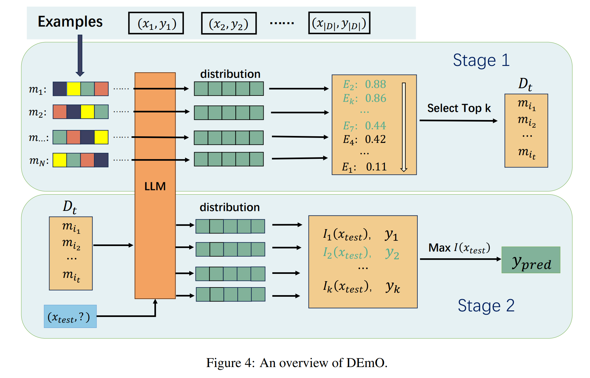
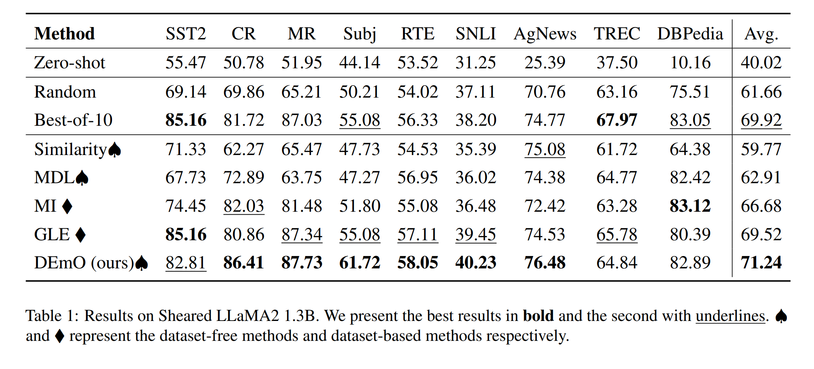

# DEmO (Accepted to Findings of ACL 2024): 
<p align="center">
   What Makes a Good Order of Examples in In-Context Learning
</p>
<p align="center">
  <strong></strong><br>
  Qi Guo<sup>1</sup>, Leiyu Wang<sup>2</sup>, Yidong Wang<sup>1</sup>, Wei Ye<sup>1†</sup>, Shikun Zhang<sup>1†</sup>
  <br><br>
  <strong></strong><br>
  <sup>1</sup>National Engineering Research Center for Software Engineering, Peking University, <sup>2</sup>National Key Laboratory for Novel Software Technology, Nanjing University
</p>

## Introduction

DEmO is **D**ataset-free **E**xa**m**ple **O**rdering framework for In-context Learning that requires no extra data. DEmO works by
filtering out a subset of orders featuring label fairness, then selecting the most influential order for each test instance. The employment of a content-free metric makes DEmO independent of in-domain data.


Extensive experiments on 9 classification tasks indicate the superiority of DEmO
over a wide range of strong baselines.


## Requirements

- Python 3.10.x
- Required Python packages listed in `requirements.txt`

## Installation

1. Clone the repository:
   ```sh
   git clone -b DEmO https://github.com/GuoQi2000/DSICL.git
   cd DSICL/DEmO
   ```

2. Install the required packages:
   ```sh
   pip install -r requirements.txt
   ```

3. Download the dataset.
   https://1drv.ms/u/c/8761b6d10f143944/EduOb-I8HwtGrpqoHFeQpRoB4ga658egIpPxjz62wgOKTg?e=Z2nPAD
   ```sh
   unzip DEmO_data.zip -d ./DEmO_data/
   ```

## Quick start

### Run DEmO
Here is the command to run and evaluate DEmO on the task "trec": \
(**Other methods are also supported (see DEmO/script for more details).**)
```sh
sh ./script/run_demo.sh --gpu 0 \
                        --task trec \
                        --model_path princeton-nlp/Sheared-LLaMA-1.3B \
                        --method DEmO \
                        --shots 4 \
                        --seed 0 \
```

The demonstrations and predictions will be saved in the `DEmO/output/` directory.

- `--gpu`: Specify the GPU to use.
- `--model_path`: The path of LLMs.
- `--method`: The method to employ for demonstration selection.
- `--shots`: Shots for ICL.
- `--seed`: Random seed.

You can also directly run the DEMO.ipynb file and employ DEmO on customized tasks.


### Run all the methods

To evaluate all the methods compared in our paper:

```sh 
sh ./script/run_all.sh  --gpu 0 \
                        --task trec \
                        --model_path princeton-nlp/Sheared-LLaMA-1.3B \
                        --seed 0
```


